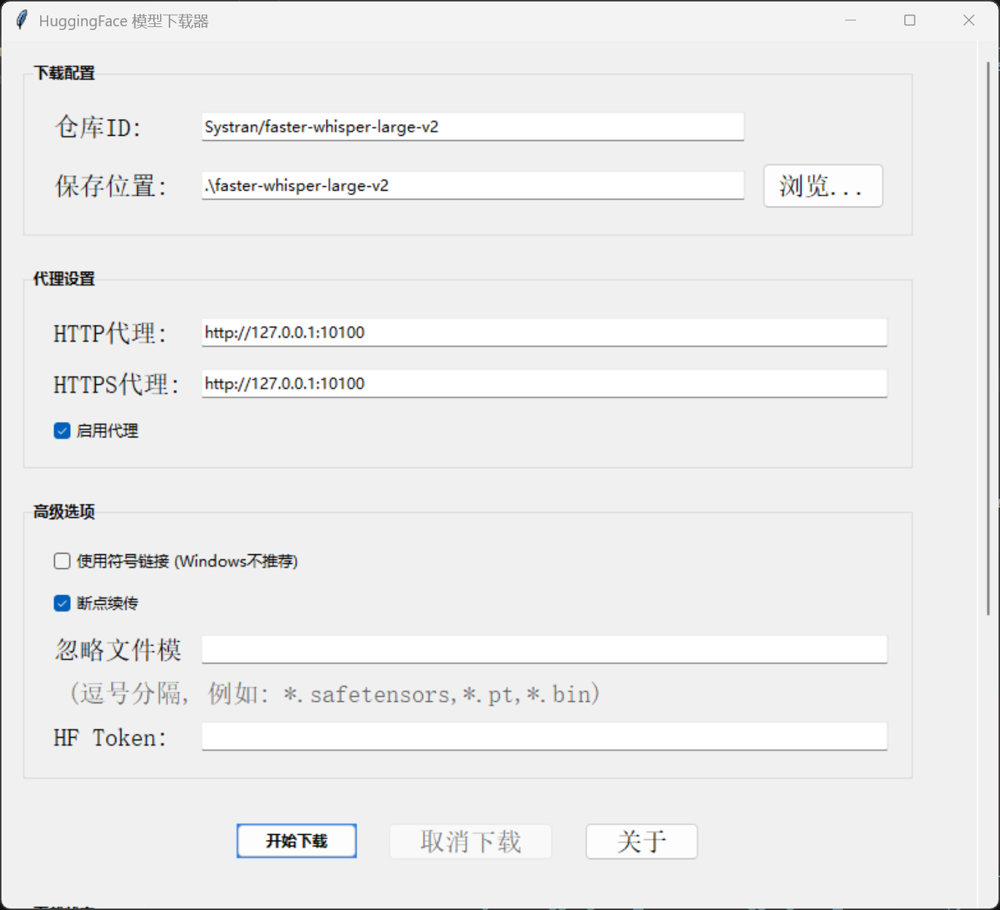

# 🚀 HuggingFace 模型下载器

[](https://github.com/Liu8Can/HuggingFaceDownloadGUI)
[](https://www.python.org/)
[](https://opensource.org/licenses/MIT)
[](https://space.bilibili.com/520050693)

一个简单易用的图形界面工具，帮助你轻松下载 HuggingFace Hub 上的模型和数据集。支持代理设置、断点续传和自定义忽略模式。



## ✨ 功能特色

- 📥 轻松下载 HuggingFace 仓库模型和数据集
- 🔄 支持断点续传功能
- 🔐 支持私有仓库（通过HF Token）
- 🌐 内置代理设置功能
- 🔍 详细的下载日志和错误诊断
- 🛠️ 自定义忽略文件模式
- 💾 支持符号链接（Linux/macOS用户推荐）

## 📋 使用要求

- Python 3.6+
- `tkinter` (通常随Python安装)
- `huggingface_hub` 库

## 🔧 安装方法

1. 克隆仓库
   ```bash
   git clone https://github.com/Liu8Can/HuggingFaceDownloadGUI.git
   cd HuggingFaceDownloadGUI
   ```

2. 安装依赖
   ```bash
   pip install -r requirements.txt
   ```

## 🚀 使用方法

### 运行程序

```bash
python huggingface_downloader.py
```

### 基本用法

1. **填写下载配置**
   - 输入模型/数据集的 HuggingFace 仓库 ID（例如：`Systran/faster-whisper-large-v2`）
   - 选择或确认保存位置

2. **配置代理**（如需）
   - 勾选"启用代理"
   - 设置HTTP和HTTPS代理地址

3. **调整高级选项**（可选）
   - 断点续传（推荐保持开启）
   - 设置忽略文件模式（例如：`*.safetensors,*.bin`）
   - 若需下载私有仓库，请输入HF Token

4. **开始下载**
   - 点击"开始下载"按钮
   - 下载过程将在日志区域显示进度

## ⚠️ 常见问题

### 大文件下载失败

大型文件（如大语言模型）可能因网络问题或HuggingFace限制而下载失败。若遇到这种情况：

1. 查看下载日志中的失败文件列表
2. 根据日志提示，访问模型仓库页面手动下载缺失文件
3. 将下载的文件放入对应的本地目录中

### 解决下载问题的常用方法

- ✅ 确保网络连接稳定
- ✅ 尝试使用稳定可靠的代理服务
- ✅ 开启断点续传选项
- ✅ 对特别大的文件，可以先通过忽略模式排除，之后再单独下载

## 📝 日志诊断

软件会自动生成详细的下载日志，包含：

- 总文件数
- 成功/失败文件数量
- 下载用时
- 失败文件列表
- 针对失败文件的建议解决方案

## 🤝 贡献

欢迎贡献代码、报告问题或提出新功能建议！请通过GitHub Issue或Pull Request参与项目开发。

## 📜 许可证

本项目采用GPL V2许可证，详见LICENSE文件。

## 👨‍💻 作者

由 [沧浪同学](https://space.bilibili.com/520050693) 开发

---

⭐ 如果这个项目对您有帮助，请考虑在GitHub上给它一个星标！ 